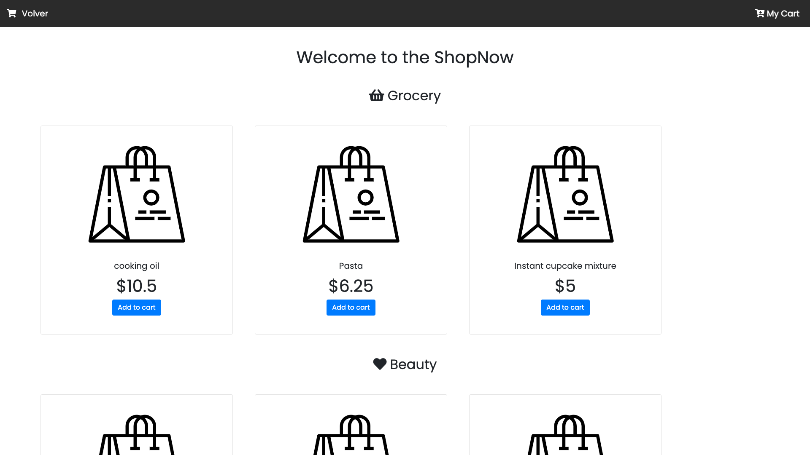
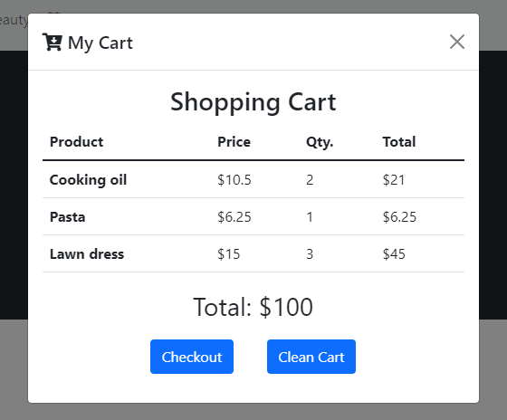
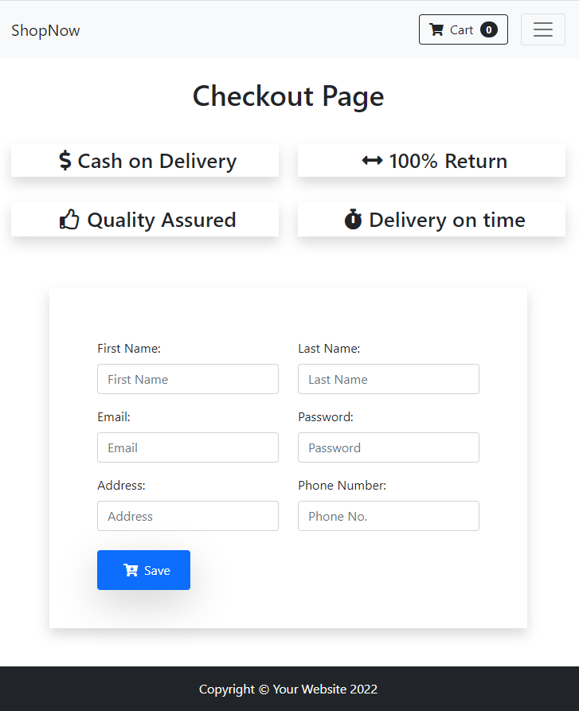

# Sprint 3. JavaScript I

Sumari

- Objectius

- Part teòrica

- Part pràctica. ***S3. Shop***

--------

## OBJECTIUS

##### **Objectius generals**

- Conèixer les funcionalitats bàsiques del JavaScript per programar.

- Programar les  primeres funcionalitats en un projecte.

- Aprendre a *debugar* per trobar els possibles errors al teu codi.


##### **Objectius específics**

- Crear i utilitzar variables JavaScript.

- Crear funcions JavaScript per dur a terme un objectiu específic.

- Fer servir arrays per a emmagatzemar dades rellevants d'una aplicació web.

- Implementar el flux complet d'una funcionalitat: petició de l'usuari, funcions JavaScript, modificació de dades i feedback a l'usuari.

- Validació de formularis.


##### **Consells útils**

- En aquest sprint és especialment important practicar molt. Normalment, els conceptes de JavaScript s'aprenen ràpidament. No obstant això, la part més difícil és saber aplicar-los a la pràctica. Et recomanem fer molts miniexercicis que trobaràs en aquest sprint.

- Dedica aproximadament la meitat de l'sprint als recursos i **l'altra meitat al lliurament.**

- **Llegeix-te l'enunciat del lliurament que està situat just al principi** de manera tranquil·la, per assolir una idea més concreta i clara sobre els objectius de l'sprint.

--------

## PART TEÒRICA

### Curs javascript bàsic

Llenguatge de programació de la web. Funciona sobre tauletes, escriptoris i telèfons perquè inclouen intèrprets de Javascript de forma nadiua als seus navegadors. No procedeix de Java. 

Amb Node, a més, tenim un intèrpret per fora dels navegadors.


Es proposen els següents ***materials didàctics públics***:

- Video de Youtube de Programador X - El mejor lenguaje para empezar ¿Qué es Javascript?: [El mejor lenguaje para empezar 👨🏽‍💻 ¿Qué es JavaScript? - YouTube](https://www.youtube.com/watch?v=Nrp3c6kNyAw)

- Video de Youtube de Kiko Palomares - Tu Primer Script en tu HTML - ¡Hola Mundo! > [Curso de JAVASCRIPT desde CERO]: [💛 Tu Primer Script en tu HTML - ¡Hola Mundo! ► [Curso de JAVASCRIPT desde CERO] #005 - YouTube](https://www.youtube.com/watch?v=dGEkAG4-Ppw)

#### Conceptos fundamentales de Javascript

Es proposen 3 cursos:

- SCRIMBA - Learn basic Javascript: https://scrimba.com/learn/basicjavascript

- CODE ACADEMY - Learn Javascript: https://www.codecademy.com/learn/introduction-to-javascript

- Youtube Fazt - Curso Javascript para Principiantes: [Curso Javascript para Principiantes - YouTube](https://www.youtube.com/watch?v=RqQ1d1qEWlE)


### Javascript Debugging

"És habitual quan programes fer errors (bugs) al nostre codi, no passa res, som humans, però és molt important saber localitzar la font de l'error i entendre perquè es produeix per poder arreglar-lo. D'això se'n diu *debugar.* 

Sense saber fer això, estem indefensos davant possibles errors i podem perdre moltíssim temps intentant endevinar que s'ha escrit malament, passant una frustració innecessària. 

Resumint, el més important que ha de saber fer un programador/a és crear programes, el segon, saber debugar-los. Maquetar, testing, consum de dades d'un servidor... és menys important, perquè t'adonis que estàs davant d'un dels temes més importants del curs!"

#### Introducció

Es proposa aquest video a Youtube de Facultad Autodidacta: [Depurar o hacer debug a javascript con google chrome - YouTube](https://www.youtube.com/watch?v=I388w3wDkjc)

#### Chrome DevTools

Enllaç a la pàgina oficial de Chrome on parlen de com depurar codi amb la seva eina. Debug Javascript: [Debug JavaScript - Chrome Developers](https://developer.chrome.com/docs/devtools/javascript/)

### Reforç + Ampliació de Javascript

>  **Per saber més**
> 
> En aquest curs tens pràctiques que podràs autocorregir.  
> **->[curs de Javascript](https://javascript.info/)**
> 
> És recomanable que facis els mòduls en els quals necessitis reforçar el teu coneixement.

### Repositori You Dont Know JS!!

A continuació et proporcionem el link a un llibre gratuït i molt complet, traduït al castellà parcialment, perquè puguis tenir-lo com a referència davant dubtes de javascript

**->[Llibre You Dont Know JS ES](https://github.com/You-Dont-Know-JS-ES/Traduccion)**

### Practicar JS!

És molt important practicar molt els conceptes apresos de JavaScript per a consolidar els coneixements i esbrinar quan saps i que has de reforçar.  

A continuació et recomanem una sèrie d'exercicis per a practicar.

#### JS Hero

Llistat d'exercicis on podràs validar si la teva solució proposada és vàlida

**[-> Exercicis de JS Hero](https://www.jshero.net/en/success.html)**

#### W3Schools

Sèrie de senzills exercicis de la famosa W3Schools on podràs veure la solució:

[**-> Exercicis de W3Schools**](https://www.w3schools.com/js/exercise_js.asp)

----

## PART PRÀCTICA: S3. SHOP

## Descripció

Ja has completat la primera fase de l'especialització, la maquetació, habilitat bàsica que ha de dominar un programador front end! Intenta continuar practicant-la en tots els lliuraments.

Com hauràs pogut observar, tens per davant 3 sprints de JavaScript / TypeScript. Hauràs d'esforçar-te molt, ja que és una part fonamental de l'especialització, si aquesta part la domines bé, la part final et serà molt més senzilla.

En aquest lliurament posarem en pràctica tots els conceptes de JavaScript bàsic. 

**Una empresa del sector e-commerce ens ha demanat una aplicació web, que li permeti oferir la compra dels seus productes a través d'internet.**

Seràs l'encarregat de muntar una versió inicial de demo de l'aplicació per al client: gestió del carret de la compra i l'aplicació de les promocions sobre el preu final. Tens 2 setmanes de termini, que és el que dura aquest sprint.  

#### Notes

Tens les següents indicacions del responsable front end:  

- Se t'ha preparat la base del projecte sobre la qual treballar: 

**-> [GitHub - IT-Academy-BCN/starter-code-frontend-sprint-3](https://github.com/IT-Academy-BCN/starter-code-frontend-sprint-3)**

**- La base del projecte sobre la qual treballaràs té ja creats tots els arxius, i una versió inicial de la interfície**, perquè puguis centrar-te a programar la lògica**.**

- Com de moment no consumim dades d'un servidor usant una API, treballarem amb **dades hardcodeadas a l'aplicación** . De moment implementarem la lògica utilitzant un petit grup de 9 productes dividits en 3 seccions.

- La lògica a implementar l'hauràs de posar a l'arxiu **src/shop.js** i **src/checkout.js**. Veuràs que ja s'han creat les funcions buides amb l'objectiu que les vagis emplenant.

- L'itinerari està plantejat per començar a utilitzar **ES6** al següent sprint, però si ja el coneixes, pots fer-lo servir en aquest sprint.

- **Est****à prohibit copiar el codi**, ja que d'aquesta manera no s'aprèn res. A més com podràs observar, després del lliurament de l'sprint 5 hi ha una mini prova de nivell amb el mentor/a, on hauràs de demostrar en directe que has adquirit els conceptes de JavaScript. No et preocupis, si treballes els lliuraments, la superaràs sense problemes.

#### Informació de les dades a manipular

Es tracta d'un array de 9 productes. Cada element de l'array és un objecte que conté la informació de cada producte de l'e-commerce. A continuació es mostra un exemple d'un producte:

{  
  "id": 1,  

  "name": "cooking oil",

  "price":  10.5,

  "type": "grocery"

}

Aquestes dades de l'array "products" no s'han de modificar.  

#### Petit aclariment sobre el DOM

El DOM permet un accés a l'estructura d'una pàgina HTML mitjançant el mapatge dels elements d'aquesta pàgina en un arbre de nodes. 

Ens serveix per a **accedir i manipular els diferents elements de l'HTML des de JavaScript**. A Angular, React i Vue no accedim a l'HTML usant el DOM, si no que ho fa la llibreria o framework per nosaltres, però com que aquest exercici és amb JavaScript pla, no tenim més remei que manipular el DOM per a mostrar els resultats a l'usuari/a. 

 **Per saber més**

Encara que no és un tema prioritari, si és necessari que tinguis coneixements bàsics de DOM i saber com funciona. A continuació tens un vídeo d'introducció a la manipulació del DOM: [Curso HTML, CSS y JS - 27. DOM. Objetos y propiedades - YouTube](https://www.youtube.com/watch?v=Z2f0y3_qKlE)


## Nivell 1

### - Exercici 1

En primer lloc, en tractar-se d'un e-commerce, **farem que l'usuari/ària pugui afegir productes al carretó.**

La funció que has de completar es diu **buy()**, la qual rep l'id del producte a afegir. Has de buscar el producte utilitzant aquest id rebut a l'array products, per finalment afegir-ho al array cartList.

Els botons que han d'executar la funció buy() són els blaus que es troben en cada producte:

  

**Ajuda**: per a buscar el producte a l'array products mitjançant l'id, pots utilitzar un bucle for.

Pren-te els exercicis amb calma, no és fàcil aprendre a programar. 

### - Exercici 2

Ara implementarem una funció que **permeti a l'usuari/ària eliminar l'array generat a l'anterior exercici: buidar el carret**.

En aquest cas, hauràs d'emplenar la funció **cleanCart()**, la qual ha de reinicialitzar la variable cartList.

**Ajuda:** En aquesta web trobaràs informació sobre com buidar un array.

**->[How do I empty an array in JavaScript?](https://stackoverflow.com/questions/1232040/how-do-i-empty-an-array-in-javascript)**

### - Exercici 3

Genial, l'e-commerce va prenent forma!, **és** **el moment de calcular el total de l'import del carretó.** 

S'ha d'implementar un bucle for per anar sumant l'import de tots els productes.

### - Exercici 4

Ho estàs fent molt bé, gairebé has completat el nivell 1!

Com hauràs pogut observar, tenim molts ítems repetits al carretó de la compra. Seria més convenient que no apareguessin repetits, sinó que cada producte del carret comptés amb un camp quantitat.

Per a això, hauràs de completar la funció **generateCart(****)**, la qual **rep l'array cartList, generant l'array cart.**

Crea un botó per tal de poder cridar a la funció **generateCart()**  

Un exemple de cada element de l'array cart és:

```javascript
{

  name: 'cooking oil',

  price: 10.5,

  type: 'grocery',

  quantity: 5,

  subtotal: 31.5,

  subtotalWithDiscount: 30

},
```

En aquest exercici no fa falta que modifiquis la funció que calcula les promocions, l'apartat de subtotalWithDiscount el calcularem més endavant. 

**Ajuda:** Simplement s'ha de fer un bucle sobre el array cartList que rep la funció. 

- Per cada element de cartList, hem de validar si existeix en el array cart:

- En cas que no existeixi, l'afegim a l'array cart (compte, que no se t'oblidi agregar la propietat quantity amb valor 1 al producte abans de fer push). 

- Si, en canvi, ja existeix aquest producte al carretó, haurem d'incrementar el camp quantity.

### - Exercici 5

Per ser un bon e-commerce, ens falta **implementar promocions,** apartat importantíssim en qualsevol botiga.

Per a això, el client ens ha transmès dos tipus de promocions que vol per a la seva e-commerce:

- Si l'usuari compra 3 o més ampolles d'oli, el preu del producte descendeix a 10 euros.
- Quan es compren 10 o més productes per a fer pastís, el seu preu es rebaixa a 2/3.

En aquest exercici has de completar la funció **applyPromotionsCart()**, la qual rep l'array cart, **modificant el camp subtotalWithDiscount en cas que s'apliqui la promoció.**

**Ajuda:** com que producte del carret té quantitat, ja pots validar si té descompte:

- En cas que un producte tingui descompte, s'ha de guardar el preu total amb descompte en el camp: subtotalWithDiscount.
- Si no s'ha d'aplicar descompte, no fa falta que guardis res.

### - Exercici 6

Ja has desenvolupat tota la lògica bàsica de l'aplicació, ha arribat el moment de **mostrar a l'usuari el carret de la compra**.

El codi en carregat de mostrar el carret de la compra en el modal amb id "**cartModal**", ha d'incloure's dins de la funció printCart(). Us donem ja creada la maquetació de la taula de productes, només caldrà modificar-la per tal que **sigui dinàmica**.

El modal del carret s'obre prement el botó del carret en la part superior dreta de la pantalla:



### - Exercici 7

Fins a aquest exercici només hem implementat la lògica de la pantalla principal de la botiga. **Ara implementarem la validació del formulari de checkout** que es troba en l'arxiu checkout.js.

Per a accedir a aquesta pantalla, has de clicar en la icona del carret de la part superior dreta de la pantalla, apareixent un modal amb el botó que et portarà a aquesta 

El teu primer objectiu serà validar el formulari **checkout.html** utilitzant el fitxer **checkout.js**



En aquest exercici hauràs d'implementar la lògica perquè els camps del formulari compleixin les següents condicions:

- Tots els camps són obligatoris.

- Tots els camps han de tenir almenys 3 caràcters.

- El nom i cognoms han de contenir només lletres.

- El telèfon ha de contenir només números.

- La contrasenya ha d'incloure números i lletres.

- L'email ha de tenir format d'email.

Quan l'usuari introdueixi un camp que no compleixi les validacions anteriors, l'input s'ha de ressaltar en vermell i mostrar un missatge a la part inferior.

**Ajuda:** podràs acolorir la vora de l'input en vermell i mostrar el missatge d'error manipulant el dom, encara que també pots usar la classe is-invalid de bootstrap.  


COMPTE!, **abans de passar al nivell 2 verifica que has entès bé tots els exercicis del nivell 1**. 

Els nivell 2 i 3 són opcionals, l'important és aprendre els conceptes de cada sprint, si l'has copiat ràpid d'internet no té valor, ja que si passes així tots els sprints, hauràs treballat molt i après poc. 

En una entrevista tècnica en una empresa o en les proves de nivell de l'itinerari (després de l'sprint 5 i 9) és detecta molt ràpid aquests casos. No retardis el teu aprenentatge, **millor fer pocs exercicis bé que molts ràpids.**

### - Exercici 8

L'usuari/ària ja pot afegir productes al carretó i se li apliquen promocions.

Hem anat ampliant el nostre **codi** amb noves funcionalitats, però a vegades fa falta un **repàs general per analitzar si podem simplificar-ho** abans de prosseguir.

Repassant el programa, es poden mantenir les funcionalitats simplificant el codi: això es diu fer un **refactor**.  

Podem deixar d'usar buy() i generateCart() (no els esborris, per a facilitar la correcció), per a generar el carretó en una única funció **addToCart**().  

A vegades és una mica tediós **refactoritzar** codi, ja que hauràs de modificar també calculateSubtotals, però s'ha d'anar netejant codi perquè sigui més mantenible.

**Ajuda:** Tingues en compte que has de validar si el producte ja existeix a l'array cart, per actualitzar la seva quantitat, o afegir-lo en cas que encara no formi part d'aquest array cart.

### - Exercici 9

ENHORABONA! Ja tens les parts principals de la botiga implementades! Al nivell 2 i 3 completarem la botiga amb algunes funcionalitats i crearem la part gràfica.

Encara no hem proporcionat una funcionalitat molt important a l'usuari/ària: **restar productes del carretó**.

Has de completar la funció **removeFromCart()**, la qual rep l'id del producte per al qual es deu decrementar la seva quantitat en una unitat.

Tingues en compte que si la quantitat del producte a decrementar és 1, has d'eliminar-lo del carret, no passar la seva quantitat a 0.

**Recordar actualitzar les promocions.**  

## Nivell 3

### - Exercici 10

Ja has arribat al final! Per tenir llesta la demo per ensenyar al client, has de maquetar la web perquè tingui un aspecte professional.

Aquí tens diversos exemples d'inspiració:

- Botiga

  

Selector inicial de categories:

  

Checkout:

  

**Ajuda:** Pots inventar-te seccions fake per la demo, com en l'exemple anterior que apareix la imatge de la dona a pantalla completa amb l'eslògan damunt, i una descripció de la botiga.

### - Exercici 11

No t'oblidis de repassar el *responsive*. Garanteix que es vegi bé a tots els dispositius: escriptori, tauleta i mòbil.

## Recordatoris

- Els sprints **duren dues setmanes.**

- **És obligatori pujar tots els lliuraments almenys amb el nivell 1** al final de l'sprint per a poder passar al següent.

## Recursos

**->[GitHub - IT-Academy-BCN/starter-code-frontend-sprint-3](https://github.com/IT-Academy-BCN/starter-code-frontend-sprint-3)**

És una bona opció buscar la imatge dels productes. A **->[unsplash.com](http://unsplash.com/)** hi ha moltes fotografies d'alta qualitat que pots utilitzar per a enriquir la teva e-commerce.

Si necessites inspiració per als teus projectes, una bona opció és recórrer a **->[dribbble.com](http://dribbble.com/)** o **->[behance.net](http://behance.net/)**, webs de portfolis de dissenyadors, per trobar algun disseny que encaixi amb el teu web i amb el teu estil.


Criteris de qualificació

Exercici 1 (N.1) funció buy(): afegir un productes al carretó.

|                                       |                                                                               |                                                                                      |
| ------------------------------------- | ----------------------------------------------------------------------------- | ------------------------------------------------------------------------------------ |
| El software no funciona<br><br>0punts | El software funciona però no utilitza els patrons requerits.<br><br>0.25punts | El software funciona i està construït d'acord amb el patró requerit.<br><br>0.5punts |

Exercici 2 (N.1) Funcionalitat cleanCart(): buidar el carretó de valors.

| El software no funciona<br><br>0punts | El software funciona però no utilitza els patrons requerits.<br><br>0.25punts | El software funciona i està construït d'acord amb el patró requerit.<br><br>0.5punts |
| ------------------------------------- | ----------------------------------------------------------------------------- | ------------------------------------------------------------------------------------ |

Exercici 3 (N.1) Càlcul de l'import total (sumant tots els productes del carretó).

| El software no funciona<br><br>0punts | El software funciona però no utilitza els patrons requerits.<br><br>0.25punts | El software funciona i està construït d'acord amb el patró requerit.<br><br>0.75punts |
| ------------------------------------- | ----------------------------------------------------------------------------- | ------------------------------------------------------------------------------------- |

Exercici 4 (N.1) funció generateCart(), rep l'array cartList, generant l'array cart.

| El software no funciona<br><br>0punts | El software funciona però no utilitza els patrons requerits.<br><br>0.25punts | El software funciona i està construït d'acord amb el patró requerit.<br><br>0.5punts |
| ------------------------------------- | ----------------------------------------------------------------------------- | ------------------------------------------------------------------------------------ |

Exercici 5 (N.1) funció applyPromotionsCart(): Implementar promocions. - Si l'usuari compra més de 3 ampolles d'oli, el preu del producte descendeix a 10 euros. - En comprar-se més de 10 mescles per a fer pastís, el seu preu es rebaixa a 2/3.

| El software no funciona<br><br>0punts | El software funciona però no utilitza els patrons requerits.<br><br>0.25punts | El software funciona i està construït d'acord amb el patró requerit.<br><br>0.5punts |
| ------------------------------------- | ----------------------------------------------------------------------------- | ------------------------------------------------------------------------------------ |

Exercici 6 (N.1) funció printCard(): Mostrar els productes del carret.

| El software no funciona<br><br>0punts | El software funciona però no utilitza els patrons requerits.<br><br>0.25punts | El software funciona i està construït d'acord amb el patró requerit.<br><br>0.75punts |
| ------------------------------------- | ----------------------------------------------------------------------------- | ------------------------------------------------------------------------------------- |

Exercici 7 (N.1) Validació del formulari de checkout.js

| El software no funciona<br><br>0punts | El software funciona però no utilitza els patrons requerits.<br><br>0.5punts | El software funciona i està construït d'acord amb el patró requerit.<br><br>1punts |
| ------------------------------------- | ---------------------------------------------------------------------------- | ---------------------------------------------------------------------------------- |

Diferents exercicis (N.1) Modificació del valor de la variable global total quan es modifiquen els valors del carretó i sigui necessari.

| El software no funciona<br><br>0punts | El software funciona però no utilitza els patrons requerits.<br><br>0.25punts | El software funciona i està construït d'acord amb el patró requerit.<br><br>0.5punts |
| ------------------------------------- | ----------------------------------------------------------------------------- | ------------------------------------------------------------------------------------ |

Exercici 8 (N.2) funció addtoCart(): Refactor: eliminant i substituint per buy() i generateCart()

| El software no funciona<br><br>0punts | El software funciona però no utilitza els patrons requerits.<br><br>0.5punts | El software funciona i està construït d'acord amb el patró requerit.<br><br>1punts |
| ------------------------------------- | ---------------------------------------------------------------------------- | ---------------------------------------------------------------------------------- |

Exercici 9 (N.2) funció removeFromCart(): resta 1 quantitat d'un produce del carretó (si la quantitat és 0: s'ha d'eliminar el producte del carretó).

| El software no funciona<br><br>0punts | El software funciona però no utilitza els patrons requerits.<br><br>0.75punts | El software funciona i està construït d'acord amb el patró requerit.<br><br>1punts |
| ------------------------------------- | ----------------------------------------------------------------------------- | ---------------------------------------------------------------------------------- |

Exercici 10 (N.3) Maquetació del disseny.

| El software no funciona<br><br>0punts | El software funciona però no utilitza els patrons requerits.<br><br>0.5punts | El software funciona i està construït d'acord amb el patró requerit.<br><br>1punts |
| ------------------------------------- | ---------------------------------------------------------------------------- | ---------------------------------------------------------------------------------- |

Exercici 11 (N.3) Responsive (adaptació a qualsevol dispositiu).

| El software no funciona<br><br>0punts | El software funciona però no utilitza els patrons requerits.<br><br>0.5punts | El software funciona i està construït d'acord amb el patró requerit.<br><br>1punts |
| ------------------------------------- | ---------------------------------------------------------------------------- | ---------------------------------------------------------------------------------- |
